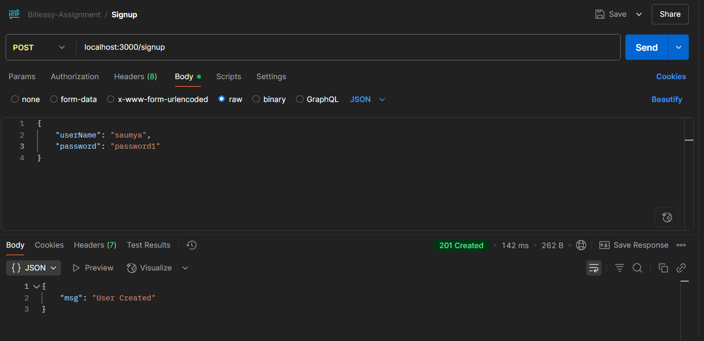
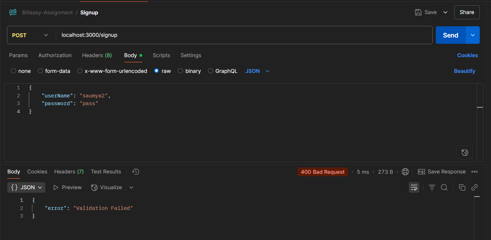
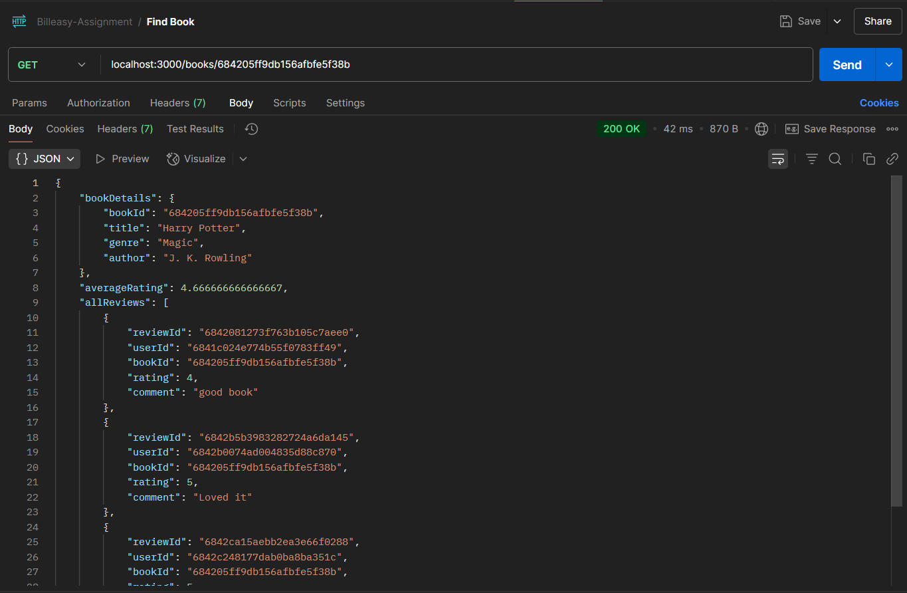
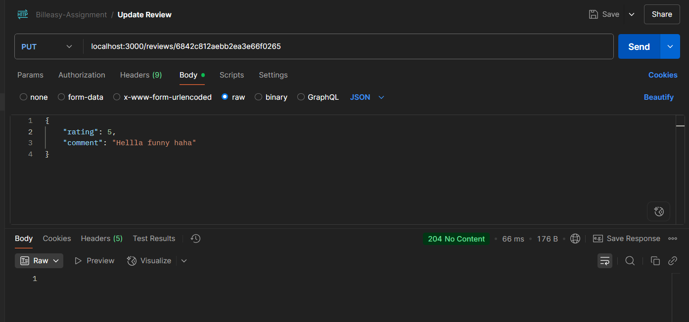
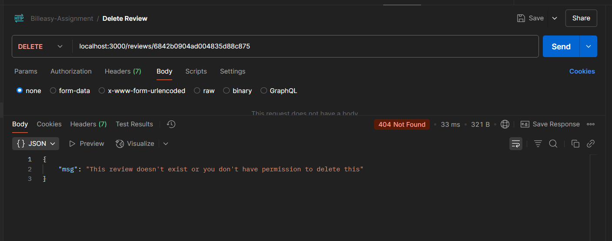
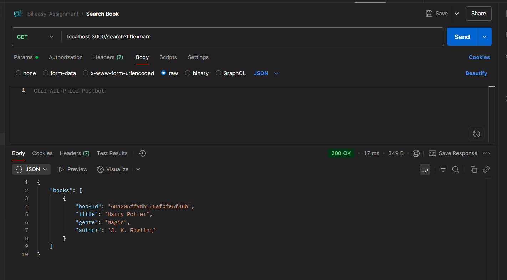

# 📚 Book Review API

A secure and modular REST API built with Node.js, Express, MongoDB, and Zod for users to register, authenticate, add books, write reviews, and search books.

---

## Project Setup Instructions

### 1. Clone the repository

```bash
git clone https://github.com/saumyea/Billeasy-Assignment.git
cd Billeasy-Assignment
```

### 2. Install dependencies

```bash
npm install
```

### 3. Configure environment variables

Create a `.env` file in the root directory:

```env
PORT = port_number
JWT_SECRET = your_jwt_secret_key
MONGO_URI = your_mongodb_connection_string
```

### 4. Connect to MongoDB

Ensure your MongoDB instance (local or Atlas) is running and reachable via the `MONGO_URL` in your `.env` file.

---

## How to Run Locally

Start the server:

```bash
node index.js
```

The server will be available at: [http://localhost:3000](http://localhost:3000)

---

## Auth Routes

### User Signup
Register a new user

**Method:** POST  
**URL:** `http://localhost:3000/signup`  
**Headers:** 
```
Content-Type: application/json
```

**Body (raw JSON):**
```json
{
  "userName": "john_doe",
  "password": "securepassword123"
}
```
**Success**

**Failure**

**Validation Failure**


---

### User Login
Authenticate user and return a token

**Method:** POST  
**URL:** `http://localhost:3000/login`  
**Headers:**
```
Content-Type: application/json
```

**Body (raw JSON):**
```json
{
  "userName": "john_doe",
  "password": "securepassword123"
}
```

> 🔑 Use the returned `token` in **Authorization** header for all protected routes:
```
Key: Authorization  
Value: Bearer YOUR_TOKEN
```
**Success**

**Failure**


---

## Book Routes (Protected)

### Add a New Book
Add a new book (Authenticated users only)

**Method:** POST  
**URL:** `http://localhost:3000/books`  
**Headers:**
```
Authorization: Bearer YOUR_TOKEN  
Content-Type: application/json
```

**Body (raw JSON):**
```json
{
  "title": "1984",
  "genre": "Dystopian",
  "author": "George Orwell"
}
```
**Success**

**Failure**


---

### Get All Books (with Filters & Pagination)
Get all books (with pagination and optional filters by author and genre)

**Method:** GET  
**URL:** `http://localhost:3000/books?page=1&limit=5&author=Orwell`  
**Headers:**
```
Authorization: Bearer YOUR_TOKEN
```
**Success**

**Failure**


---

### Get Book Details by ID
Get book details by ID, including:
- Average rating
- Reviews (with pagination)
**Method:** GET  
**URL:** `http://localhost:3000/books/BOOK_ID`  
**Headers:**
```
Authorization: Bearer YOUR_TOKEN
```

> Replace `BOOK_ID` with the actual book's ID from your database.

**Success**

---

## Review Routes (Protected)

### Submit a Review
Submit a review (Authenticated users only, one review per user per book)

**Method:** POST  
**URL:** `http://localhost:3000/books/BOOK_ID/reviews`  
**Headers:**
```
Authorization: Bearer YOUR_TOKEN  
Content-Type: application/json
```

**Body (raw JSON):**
```json
{
  "rating": 5,
  "comment": "Amazing read!"
}
```
**Success**

**Failure**

---

### Update Your Review
Update your own review

**Method:** PUT  
**URL:** `http://localhost:3000/reviews/BOOK_ID`  
**Headers:**
```
Authorization: Bearer YOUR_TOKEN  
Content-Type: application/json
```

**Body (raw JSON):**
```json
{
  "rating": 4,
  "comment": "Updated opinion"
}
```

> Replace `BOOK_ID` with the ID of the review’s associated book.

**Success**

**Failure - can't update other's review**

---

### Delete Your Review
Delete your own review

**Method:** DELETE  
**URL:** `http://localhost:3000/reviews/BOOK_ID`  
**Headers:**
```
Authorization: Bearer YOUR_TOKEN
```
**Success**

**Failure**

---

## Search Route (Protected)

### Search Books by Title or Author
Search books by title or author (partial and case-insensitive)

**Method:** GET  
**URL:** `http://localhost:3000/search?title=1984`  
**Headers:**
```
Authorization: Bearer YOUR_TOKEN
```

You can also search by author:
```
http://localhost:3000/search?author=Orwell
```
**Success**

---

## Entity Relationship Diagram 


## Brief Schema Design

### User

| Field            | Type   | Description                     |
|------------------|--------|---------------------------------|
| `userName`       | String | Unique username                 |
| `hashedPassword` | String | Encrypted using bcrypt          |

---

### Book

| Field    | Type   | Description          |
|----------|--------|----------------------|
| `title`  | String | Title of the book    |
| `genre`  | String | Genre of the book    |
| `author` | String | Author's name        |

---

### Review

| Field     | Type     | Description                       |
|-----------|----------|-----------------------------------|
| `bookId`  | ObjectId | Reference to the Book             |
| `userId`  | ObjectId | Reference to the User             |
| `rating`  | Number   | Rating out of 5                   |
| `comment` | String   | Text review                       |

> A **unique constraint** is enforced on `(bookId, userId)` to ensure one review per user per book.

---

## Design Decisions & Assumptions

- JWT authentication is used for all protected routes.
- Passwords are hashed securely using `bcrypt`.
- Input data is validated using `zod`.
- Each user can submit only one review per book.
- Book ratings are averaged via aggregation queries.
- Case-insensitive partial search is supported.
- Pagination is implemented for book listing.

---

## Folder Structure Overview

```
.
├── routes/
│   ├── authentication.js
│   ├── books.js
│   ├── reviews.js
│   └── search.js
├── schema/
│   ├── dbSchema.js
│   └── zodSchema.js
├── middleware/
│   └── user_auth.js
├── .env
├── index.js
└── package.json
```

---

## Contributing

Feel free to suggest improvements, or fork this project. Happy coding! 
